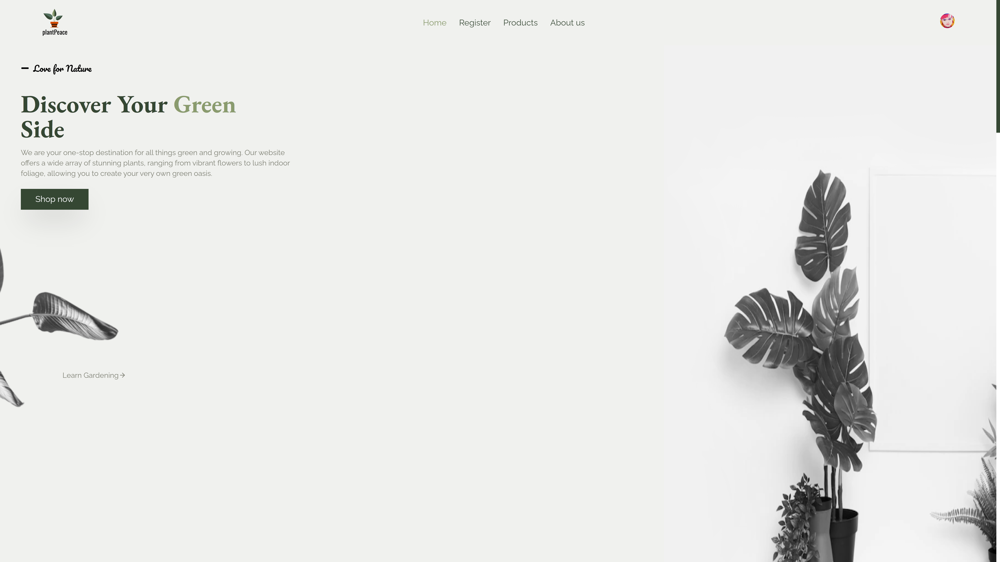
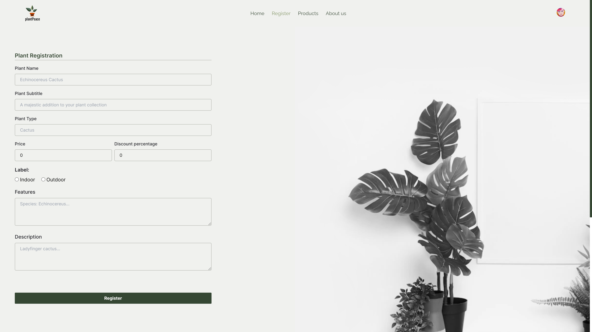

# Plant Peace 🌻 - Desafio 2 🐱‍👤 | Programas de Bolsas React

## Descrição do projeto

- Desenvolver em grupo uma página página de uma loja fictícia de plantas seguindo um protótipo do Figma
- As páginas do site são:
  - Home
  - Products
  - Register
  - About us

Há ainda uma página que mostra um produto específico ao clicar no produto, os dados são mostrados dinamicamente e vêm do arquivo `plants.json`

## 🚨 Requisitos Obrigatórios

- Utilize TypeScript para tipagem;
- Utilize Clerk, uma biblioteca para lidar com a autenticação do usuário. A documentação linkada está detalhada e fornece todas as informações necessárias para aplicar esta funcionalidade;
- O ícone do perfil do usuário no componente de Header precisa ser importado do Clerk;
- React Router para criação das rotas, sendo que é necessário proteger as rotas;
- Crie controles deslizantes para exibição das plantas nas sessões da Home, em formato de Carrossel.
- JSON Server para simular um database
- Criar, no mínimo, um método POST e um método GET para preencher o “database” e ler as informações;
- Ao preencher o formulário de registro, as plantas devem ser renderizadas em tempo real nas duas sessões de plantas da página inicial;
- Caso uma planta tenha desconto, ela será renderizada na seção “Plants in Sale”. Você precisa usar a porcentagem do banco de dados JSON Server para calcular o desconto e exibir o preço final;
- Os campos de formulário devem ser todos validados;
- Ao clicar no cartão de uma planta, é necessário redirecionar o usuário para a rota específica que contém suas informações detalhadas (Product Page);
- Você precisa criar uma página “About Us” que contenha informações sobre os desenvolvedores. Use sua imaginação para criar esta página, basta usar a mesma paleta de cores;
- A aplicação deve estar responsiva;
- Crie um repositório privado em seu Github e adicione os instrutores como colaboradores do projeto;
- Adicione um README ao seu projeto;
- Faça pequenos commits e use Convencionais Commits para manter seu repositório organizado.

## 🙋‍♂️ Integrantes

- [Danilo Salvato](https://github.com/DaniloSalvato) (SM)
- [Bruno Henrique Messias](https://github.com/m3ssJS)
- [Sarah Oliveira](https://github.com/soliveirarm)
- [Viviane Meneguin](https://github.com/vivianemeneguin)
- [Letícia dos Santos](https://github.com/leeduarda)

## 🔨 Tecnologias utilizadas

- React
- Typescript
- [Vite](https://vitejs.dev/)
- [Clerk](https://clerk.com/docs/quickstarts/react) para autenticação do usuário
- [JSON Server](https://github.com/typicode/json-server) para simular um banco de dados e realizar requisições (POST e GET)
- [Splide](https://splidejs.com/) para criar o carrossel de produtos da página
- [React Router](https://reactrouter.com/en/main) para criar rotas dentro da página e criar uma SPA (Single Page Application)

## 🎉 Como contribuir

```bash
    # Clone the project
    $ git clone https://github.com/DaniloSalvato/desafio-2-semana-8.git
```

```bash
    # Enter directory
    $ cd desafio-2-semana-8
```

```bash
    # Executar a instalação dos modulos
    $ npm i
```

```bash
    # Rodar o projeto

    # Primeiro terminal
    $ npm run dev
```

```bash
    # É necessário a criação de 2 terminais adicionais para a execução dos jsonServer databases

    # Segundo terminal
    $ npx json-server --watch src/data/plants.json

    # Terceiro terminal
    $ npx json-server --watch src/data/devs.json -p 8080
```

## ✨ Imagens do site

### Home



### Register



### Products


### Product


### About us


